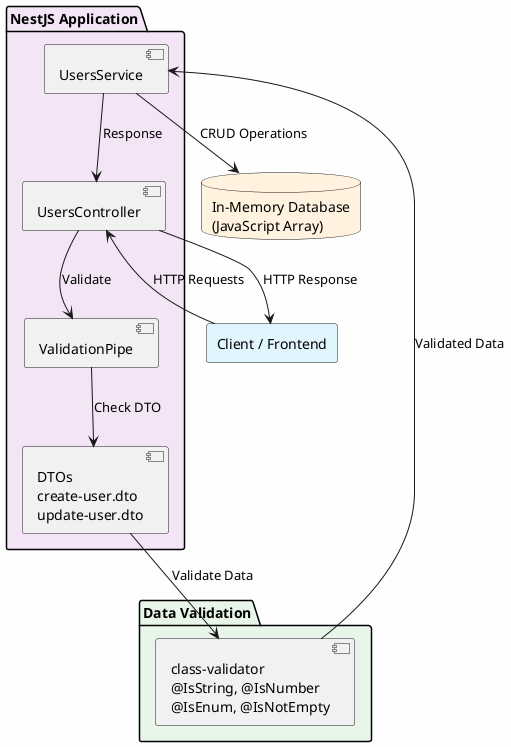

## NestJS-CRUD-API

This project implements a standard CRUD pattern reinforced by access control and automated request filtering.

## Core features

* In-Memory CRUD: Performs Create, Read, Update, and Delete operations using a local mock database (JavaScript Array).

* Data Validation: Uses ValidationPipe and class-validator (DTOs) to enforce strict data types for name, age, and role before processing requests.

* Role Filtering: The GET /users endpoint supports optional query parameters to filter users by their specific roles.

* Exception Handling: Implements built-in NestJS exceptions (like NotFoundException) to return clear HTTP error messages when a user ID does not exist.

* Unique Identification: Automatically generates randomUUID for every new user created to ensure unique indexing.

## Project setup

```bash
$ npm install
```

## Compile and run the project

```bash
# development
$ npm run start

# watch mode
$ npm run start:dev

# production mode
$ npm run start:prod
```

## API Endpoints

### Base URL
```
http://localhost:3000/users
```

### Endpoints

| Method | Endpoint | Description | Query/Params |
|--------|----------|-------------|--------------|
| **GET** | `/users` | Retrieve all users | `?role=ADMIN\|STUDENT\|PROFESSOR` (optional) |
| **GET** | `/users/:id` | Retrieve a specific user by ID | `id` - UUID of the user |
| **POST** | `/users` | Create a new user | Request body (see below) |
| **PUT** | `/users/:id` | Update a user | `id` - UUID of the user, Request body |
| **DELETE** | `/users/:id` | Delete a user | `id` - UUID of the user |

### Request/Response Examples

#### POST /users - Create User
**Request Body:**
```json
{
  "name": "John Doe",
  "age": 25,
  "description": "Computer Science student",
  "role": "STUDENT"
}
```

**Response (201):**
```json
{
  "id": "550e8400-e29b-41d4-a716-446655440000",
  "name": "John Doe",
  "age": 25,
  "description": "Computer Science student",
  "role": "STUDENT"
}
```

#### GET /users?role=ADMIN - Get Users by Role
**Response (200):**
```json
[
  {
    "id": "550e8400-e29b-41d4-a716-446655440001",
    "name": "Jane Smith",
    "age": 35,
    "description": "System Administrator",
    "role": "ADMIN"
  }
]
```

#### PUT /users/:id - Update User
**Request Body:**
```json
{
  "name": "Jane Doe",
  "age": 26,
  "description": "Updated description",
  "role": "PROFESSOR"
}
```

**Response (200):**
```json
{
  "id": "550e8400-e29b-41d4-a716-446655440000",
  "name": "Jane Doe",
  "age": 26,
  "description": "Updated description",
  "role": "PROFESSOR"
}
```

## Architecture Diagram



## Demo Video

[](https://youtu.be/6CABFfZzX2M)